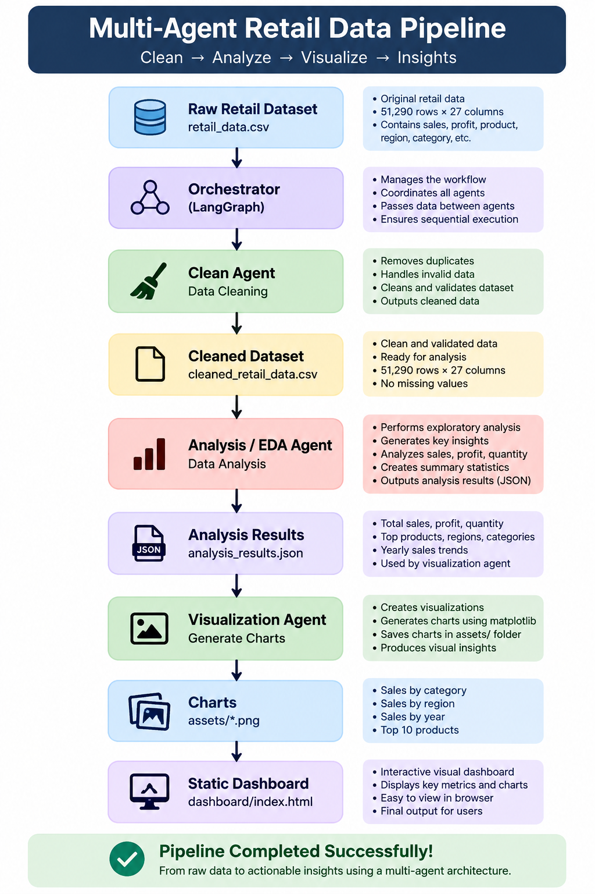
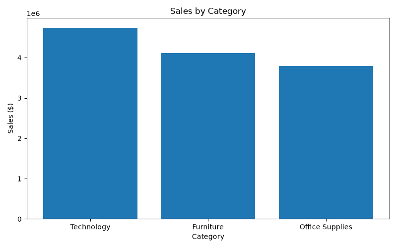
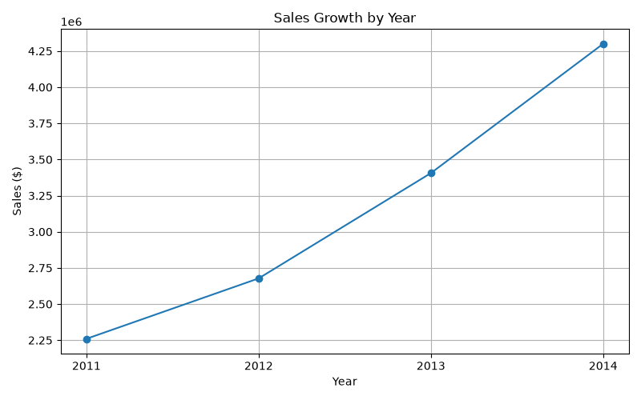
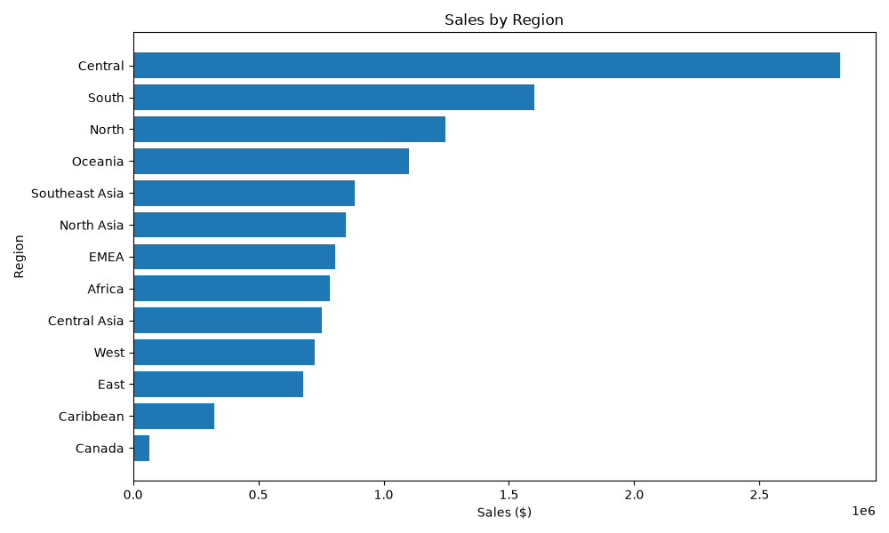
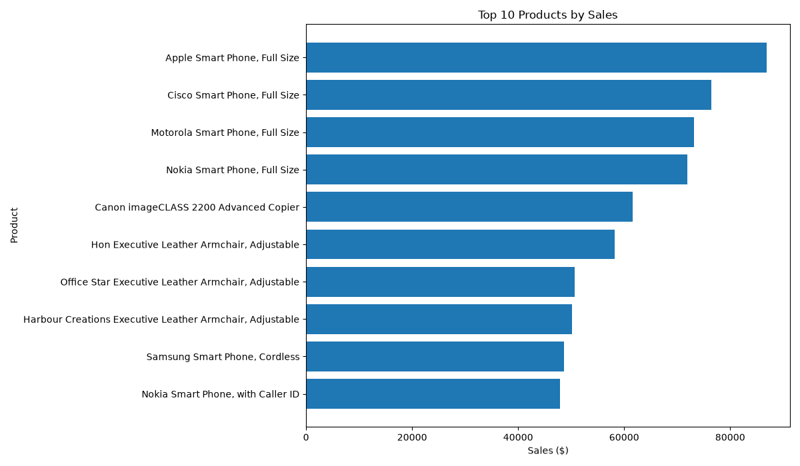
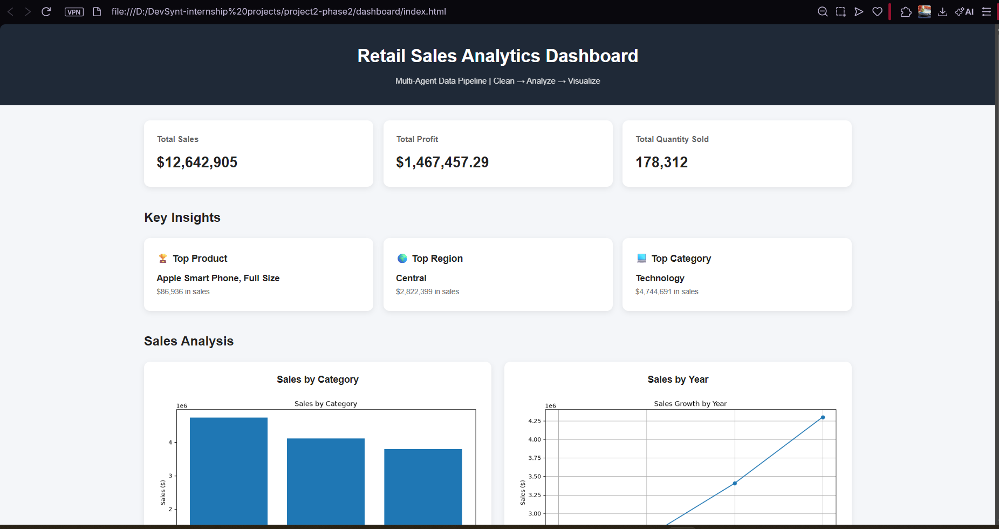
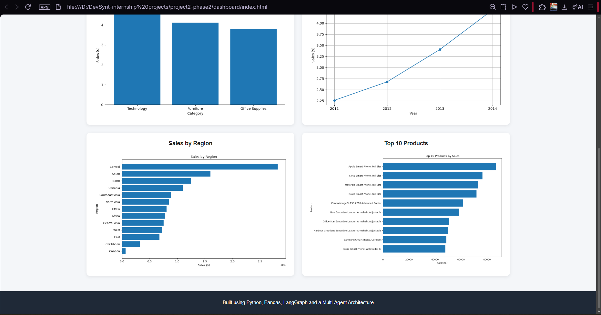

# Multi-Agent Retail Data Pipeline

## 📌 Project Overview

This project is a multi-agent retail data processing pipeline built using **Python, Pandas, LangChain, and LangGraph**.

The pipeline takes a raw retail sales dataset and processes it through multiple specialized agents. Each agent is responsible for a specific task, while an **Orchestrator Agent** controls the execution flow.

The complete pipeline performs:

1. Data Cleaning
2. Exploratory Data Analysis (EDA)
3. Data Visualization
4. Dashboard Presentation

---

# 🏗️ Project Architecture

The project follows a sequential multi-agent architecture:

```text
Raw Retail Dataset
        ↓
🧠 Orchestrator Agent (LangGraph)
        ↓
🧹 Clean Agent
        ↓
Cleaned Retail Dataset
        ↓
📊 Analysis / EDA Agent
        ↓
Analysis Results
        ↓
📈 Visualization Agent
        ↓
Charts
        ↓
🖥️ Static Dashboard
```

## Workflow Diagram



---

## 🤖 Agents

### 1. 🧠 Orchestrator Agent

The Orchestrator Agent manages the complete workflow using **LangGraph**.

It controls the execution order of the agents:

**Clean Agent → Analysis Agent → Visualization Agent**

The Orchestrator ensures that each agent receives the output from the previous stage.

### 2. 🧹 Clean Agent

The Clean Agent prepares the raw retail dataset for analysis.

It performs the following tasks:

- Checks for missing values
- Checks for duplicate rows
- Converts date columns to the correct data type
- Removes invalid rows when necessary
- Saves the cleaned dataset

### 3. 📊 Analysis / EDA Agent

The Analysis Agent performs exploratory data analysis on the cleaned retail dataset.

It generates:

- Total Sales
- Total Profit
- Total Quantity Sold
- Top 10 Products by Sales
- Sales by Region
- Sales by Category
- Sales by Year

### 4. 📈 Visualization Agent

The Visualization Agent converts the analysis results into visual charts.

It generates:

- Sales by Category
- Sales by Region
- Sales by Year
- Top 10 Products by Sales

### 🧹 Cleaning Results

- **Original Rows:** 51,290
- **Missing Values:** 0
- **Duplicate Rows:** 0
- **Invalid Rows Removed:** 0
- **Final Rows:** 51,290

### 📊 Key Analysis Results

| Metric | Result |
|---|---:|
| Total Sales | $12,642,905 |
| Total Profit | $1,467,457.29 |
| Total Quantity Sold | 178,312 |

### 🏆 Top Insights

- **Top Category:** Technology — $4,744,691 in sales
- **Top Region:** Central — $2,822,399 in sales
- **Top Product:** Apple Smart Phone, Full Size — $86,936 in sales
- **Highest Sales Year:** 2014 — $4,300,041 in sales

---

## 📈 Generated Visualizations

### Sales by Category



### Sales by Year



### Sales by Region



### Top 10 Products by Sales



---

## 🖥️ Static Dashboard

A simple static dashboard was created to present the final results of the multi-agent pipeline.

The dashboard displays:

- Total Sales
- Total Profit
- Total Quantity Sold
- Top Product
- Top Region
- Top Category
- Sales by Category
- Sales by Year
- Sales by Region
- Top 10 Products by Sales

### Dashboard Preview





---

## 🚀 How to Run the Project

### 1. Clone the repository

```bash
git clone <your-repository-url>
cd project2-phase2
```

### 2. Create and activate a virtual environment

```bash
py -3.12 -m venv .venv
.venv\Scripts\activate
```

### 3. Install dependencies

```bash
pip install pandas matplotlib langchain langgraph langchain-google-genai python-dotenv
```

### 4. Run the complete multi-agent pipeline

```bash
python agents\orchestrator.py
```

### 5. Open the dashboard

Open:

```text
dashboard/index.html
```

in your web browser.

---

## 🛠️ Technologies Used

- Python 3.12
- Pandas
- Matplotlib
- LangChain
- LangGraph
- HTML
- CSS
- JavaScript

---

## ✅ Project Completion

This project successfully implements an end-to-end multi-agent retail data pipeline.

The complete workflow:

1. Receives raw retail sales data.
2. Cleans and validates the dataset.
3. Performs exploratory data analysis.
4. Generates structured analysis results.
5. Creates visualization charts.
6. Presents the results in a static dashboard.

The workflow is coordinated by an **Orchestrator Agent using LangGraph**.

---

## 👨‍💻 Author

**Muhammad Abdullah Haroon**

Project 2 – Phase 2
Multi-Agent Retail Data Pipeline
