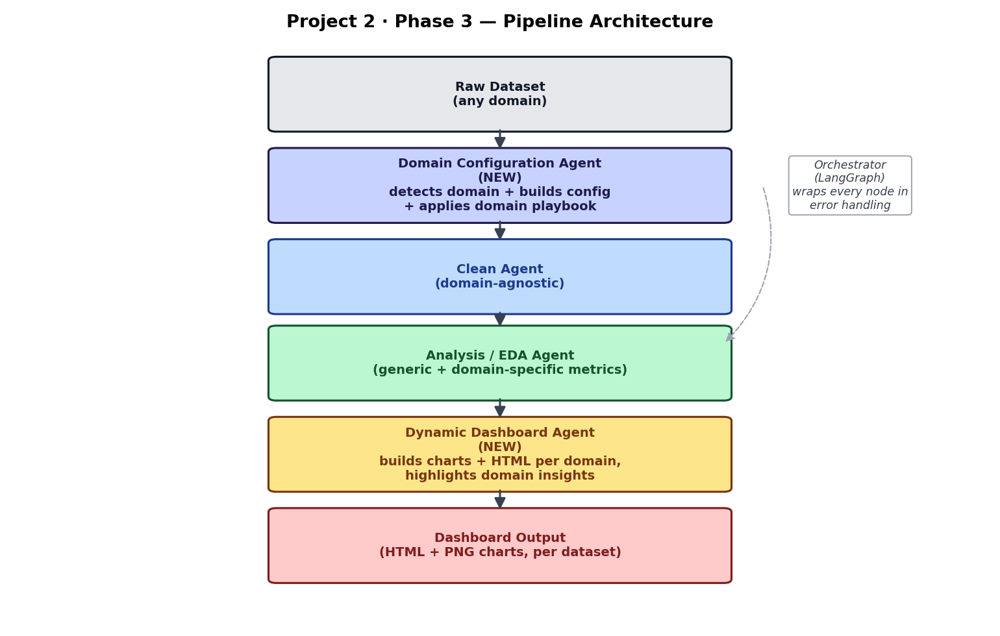
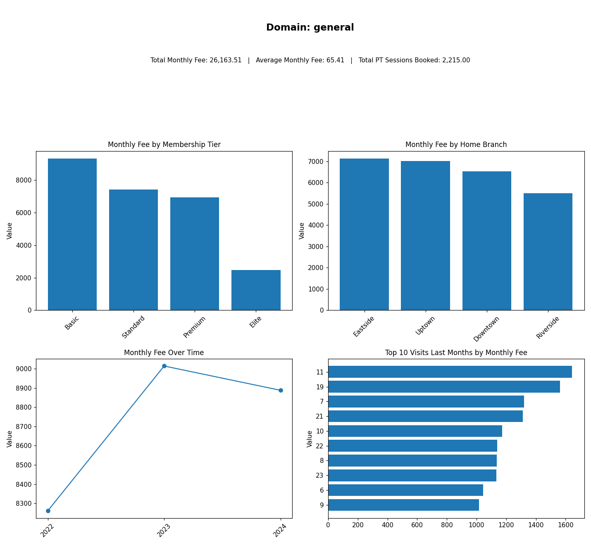
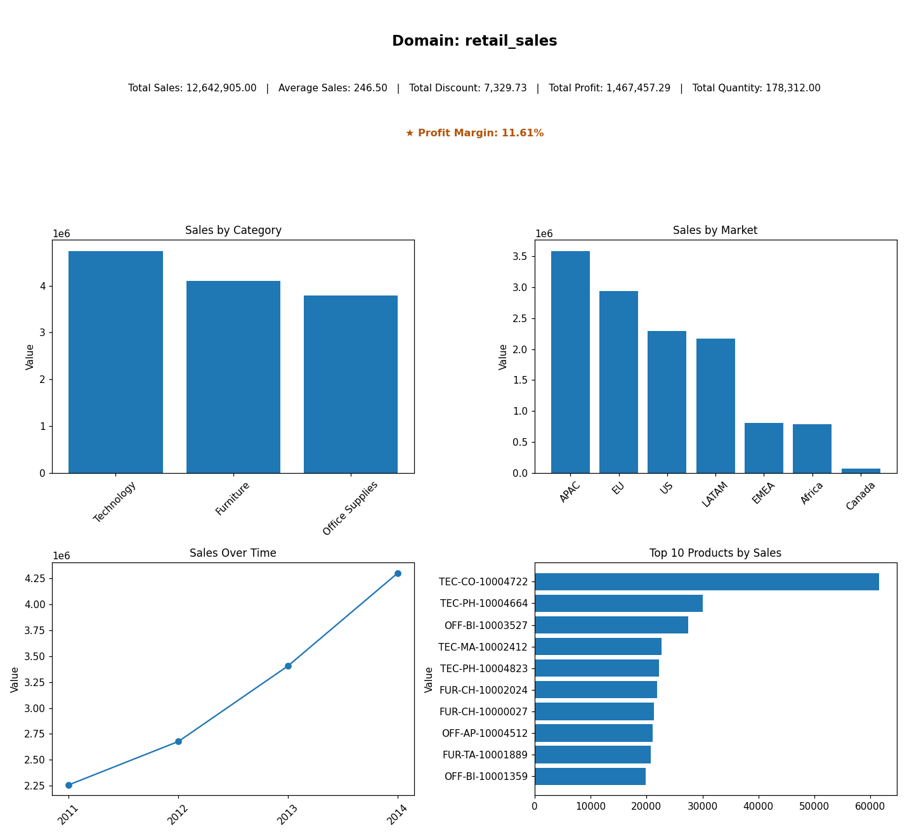
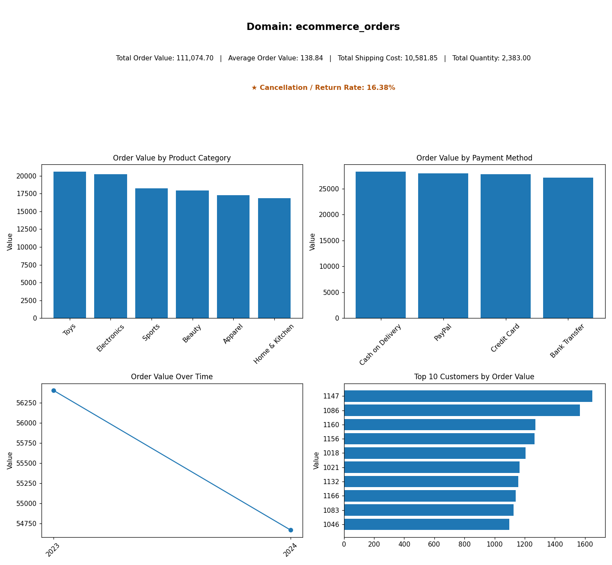
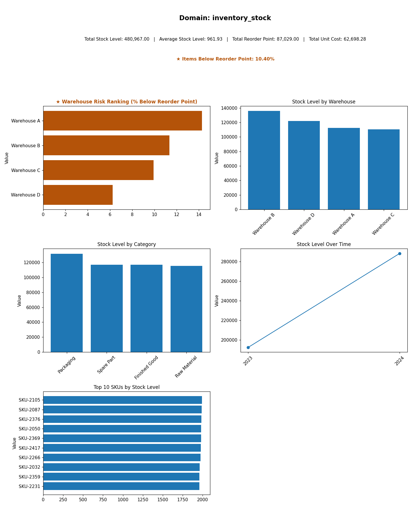
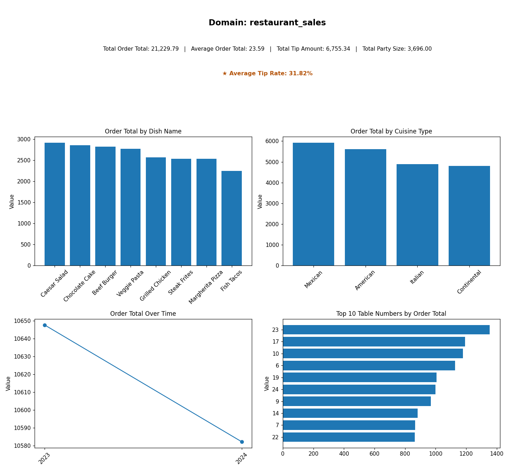
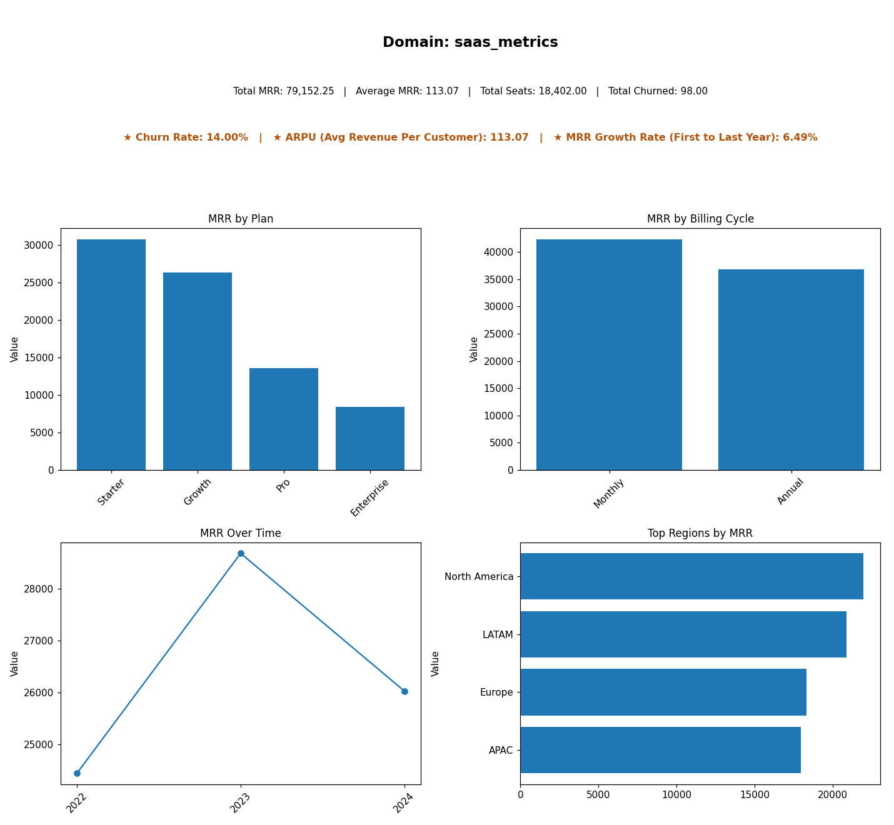

# Domain-Aware Multi-Agent Dashboard Pipeline

**Project 2 — Phase 3 · DevSynt AI Automation Internship**
**Author:** Muhammad Abdullah Haroon · Mentor: Afnan Shoukat

## Overview

Phase 2 built a working multi-agent pipeline that cleaned, analyzed, and
visualized one static retail dataset. Phase 3 turns that prototype into a
system that works on **any tabular dataset**, regardless of domain, without
touching the code.

Two new agents make this possible:

- **Domain Configuration Agent** — looks at an incoming dataset's columns
  and sample rows, decides what domain it is (retail sales, e-commerce
  orders, inventory, restaurant sales, SaaS metrics, or a general fallback),
  and builds a config describing which columns matter and what metrics/
  breakdowns make sense.
- **Dynamic Dashboard Agent** — builds the dashboard (charts + HTML) from
  that config, with no hardcoded chart types or column names for any
  specific dataset.

Everything downstream (cleaning, analysis) reads that config instead of
assuming a fixed schema, which is what makes the same code run correctly on
five structurally unrelated datasets.

## Domain-Specific Insights (not just generic automation)

Every dataset gets a baseline of generic, automatically-detected metrics
(Total X, Average X, X by category, Top 10 by X) — that layer proves the
automation works on any schema. On top of that, a **domain playbook**
(`_apply_domain_playbook` in `domain_config_agent.py`) adds real
domain-specific analysis when the relevant columns exist, rendered as
distinct gold/starred cards and charts in every dashboard:

| Domain | Domain-specific insight added |
|---|---|
| Inventory Stock | `% Items Below Reorder Point` + `Warehouse Risk Ranking` (rate of at-risk SKUs per warehouse) |
| SaaS Metrics | `Churn Rate`, `ARPU (Avg Revenue Per Customer)`, `MRR Growth Rate (First → Last Year)` |
| Retail Sales | `Profit Margin` (Profit ÷ Sales) |
| E-commerce Orders | `Cancellation / Return Rate` |
| Restaurant Sales | `Average Tip Rate` |

This runs deterministically on **every** config regardless of whether the
LLM or the rule-based fallback produced it — domain intelligence doesn't
depend on the LLM call succeeding. See `assets/prompt-evolution-log.md`
("Round 2") for exactly how this was added and why.

## Architecture



```
Raw Dataset (any domain)
        │
        ▼
Domain Configuration Agent   ← NEW. Classifies domain, picks key columns,
        │                       decides generic metrics/breakdowns, then
        │                       applies the domain playbook for insights.
        ▼
Clean Agent                  ← Now domain-agnostic: reads date/numeric
        │                       columns from the config instead of assuming
        │                       "Order.Date" / "Sales" exist.
        ▼
Analysis / EDA Agent         ← Computes both generic aggregates and
        │                       domain-specific ratios/rates/growth for
        │                       THIS dataset.
        ▼
Dynamic Dashboard Agent      ← NEW. Builds charts + an HTML dashboard by
        │                       looping over the config's metrics/
        │                       breakdowns, highlighting domain insights
        │                       separately from generic automation.
        ▼
Dashboard Output (HTML + PNG charts, per dataset)
```

The **Orchestrator** (`agents/orchestrator.py`) wires these four agents
together as a LangGraph state graph, with every node wrapped so a failure
in one stage is recorded and stops that dataset's run cleanly instead of
crashing the whole batch — see [Error Handling](#error-handling--production-grade-behavior).

### Domain Configuration Agent: LLM-first, with a safety net

The Domain Configuration Agent tries an LLM call first (Gemini, via
`langchain-google-genai` — same stack as the rest of this project), so
domain classification is based on genuinely reading the column names,
dtypes, and sample rows, not just keyword matching. If no `GOOGLE_API_KEY`
is set, the call fails, or the model returns something that doesn't parse
as valid JSON referencing real columns, the agent **falls back to a
deterministic rule-based classifier** automatically — the pipeline never
breaks just because a key is missing.

All the testing documented below ran on the rule-based fallback (no API key
was available in the dev environment). Set `GOOGLE_API_KEY` in a `.env`
file to exercise the LLM path instead — both paths produce the exact same
config schema, so nothing downstream needs to change.

## Proof This Is Genuine Detection, Not Five Hand-Built Dashboards

A fair question a strict grader might ask: *did the student manually build
five dashboards, or does the system genuinely detect/configure the domain
and generate them?*

Run this yourself:

```bash
cd agents
python prove_genuine_detection.py
```

It does two things:
1. **Statically scans all five agent files** for any `if dataset ==
   "..."` / filename-based branching. There is none — the only
   domain-conditional logic branches on the *detected* domain string
   inside the playbook, not on which file was loaded.
2. **Runs the full pipeline live on a 6th dataset** —
   `unseen_domain_gym_memberships.csv` — that was never used while writing
   `DOMAIN_KEYWORDS` or the domain playbook (no "gym"/"membership"/
   "fitness" keyword appears anywhere in this codebase). It correctly
   falls through to the honest `general` domain and still produces a
   working dashboard using only automatic column-role detection:

   

   No domain-specific insight cards appear here — because `general` isn't
   in the playbook. That absence is itself part of the proof: the system
   isn't faking insights it doesn't actually have a basis for.

This unseen-dataset run is also what caught a real bug during this round
of testing (see `assets/prompt-evolution-log.md`, "v8 → v9") — further
evidence the detection logic is actually running the columns through real
code, not returning canned output.

## Results Across All 5 Test Datasets

Every dataset below ran through the **exact same, unmodified pipeline code**.

| Dataset | Detected Domain | Primary Metric | Rows | Result |
|---|---|---|---|---|
| Retail Sales | `retail_sales` | Total Sales: $12,642,905 | 51,290 |  |
| E-commerce Orders | `ecommerce_orders` | Total Order Value: $111,074.70 | 800 |  |
| Inventory Stock | `inventory_stock` | Total Stock Level: 480,967 units | 500 |  |
| Restaurant Sales | `restaurant_sales` | Total Order Total: $21,229.79 | 900 |  |
| SaaS Metrics | `saas_metrics` | Total MRR: $79,152.25 | 700 |  |

Each dataset also has its own full interactive dashboard (HTML + individual
chart PNGs) under `assets/<dataset_name>/dashboard.html`. See
`test-datasets/README.md` for where each dataset came from.

Beyond the generic metrics, notice each dashboard also carries the
domain-specific insight(s) from the table above (gold/starred in the HTML
and composite images) — Warehouse Risk Ranking for inventory, Churn Rate/
ARPU/Growth for SaaS, Profit Margin for retail, and so on. None of that is
hardcoded per file; it comes from the domain playbook matching against
whatever columns each dataset's Domain Configuration Agent run actually
detected.

## Error Handling — Production-Grade Behavior

Two things were deliberately tested to confirm the pipeline doesn't just
work on "clean" inputs:

1. **Malformed data** — a CSV with mixed types in its numeric column,
   unparseable dates, duplicates, and missing values. The pipeline didn't
   crash: it degraded to a `general` domain with no metrics (since the
   broken column couldn't be coerced to numeric), cleaned what it safely
   could, and still produced a minimal dashboard.
2. **A nonexistent file path** — the orchestrator caught the error at the
   first stage, recorded `status: FAILED` with the failing stage and
   message in the pipeline state, and stopped that run — no uncaught
   traceback, and (via `run_all_datasets.py`) the other datasets in a batch
   are unaffected.

See `qa-error-handling-test/` for the artifacts from that test, and
`assets/prompt-evolution-log.md` for the full list of bugs this testing
phase actually caught and how each was fixed — including a case where the
cleaning step was silently deleting ~25% of valid retail rows because it
treated a legitimately-negative `Profit` column the same as `Sales`.

## How to Run

### 1. Set up environment

```bash
cd project2-phase3
py -3.12 -m venv .venv
.venv\Scripts\activate        # Windows
pip install -r requirements.txt
```

### 2. (Optional) Enable the LLM-based domain classification

Create a `.env` file in `project2-phase3/`:

```
GOOGLE_API_KEY=your_key_here
```

Without this, the pipeline automatically uses the rule-based fallback
classifier — it still works, just without LLM reasoning over the columns.

### 3. Run the pipeline on one dataset

```bash
cd agents
python orchestrator.py
```

### 4. Run the full batch across all test datasets

```bash
cd agents
python run_all_datasets.py
```

This prints a summary of detected domain / metrics / breakdowns per
dataset and writes `test-datasets/_work/batch_summary.json`.

### 5. Prove the detection is genuine (see section above)

```bash
cd agents
python prove_genuine_detection.py
```

### 6. View a dashboard

Open any `assets/<dataset_name>/dashboard.html` in a browser, or view the
composite preview PNGs directly (`assets/dataset1-result.png`, etc.).

## Project Structure

```
project2-phase3/
├── agents/
│   ├── domain_config_agent.py   (NEW — domain detection + config + playbook)
│   ├── clean_agent.py           (rewritten — domain-agnostic)
│   ├── analysis_agent.py        (rewritten — generic + domain-specific metrics)
│   ├── dashboard_agent.py       (NEW — dynamic dashboard, highlights insights)
│   ├── orchestrator.py          (rewritten — 4-stage graph + error handling)
│   ├── run_all_datasets.py      (NEW — batch test runner)
│   └── prove_genuine_detection.py  (NEW — live proof of genuine detection)
├── test-datasets/
│   ├── retail_sales.csv, ecommerce_orders.csv, inventory_stock.csv,
│   │   restaurant_sales.csv, saas_metrics.csv
│   ├── unseen_domain_gym_memberships.csv  (generalization proof dataset)
│   └── README.md                (dataset sources)
├── assets/
│   ├── flow-diagram.png
│   ├── dataset1-result.png ... dataset5-result.png
│   ├── unseen_domain_gym_memberships-result.png
│   ├── prompt-evolution-log.md
│   └── <dataset_name>/dashboard.html + chart PNGs  (per dataset)
├── qa-error-handling-test/      (malformed-data + missing-file test evidence)
├── requirements.txt
└── README.md
```

## Technologies Used

Python 3.12 · Pandas · Matplotlib · LangChain · LangGraph ·
langchain-google-genai (Gemini) · HTML/CSS/JS

## What's Next

- Swap the 4 synthetic test datasets for real Kaggle datasets in the same
  domains (see `test-datasets/README.md` for suggestions) before final
  presentation, for extra authenticity.
- Run with `GOOGLE_API_KEY` set to exercise the LLM-based domain
  classification path and compare its choices against the rule-based
  fallback's on a few datasets.
